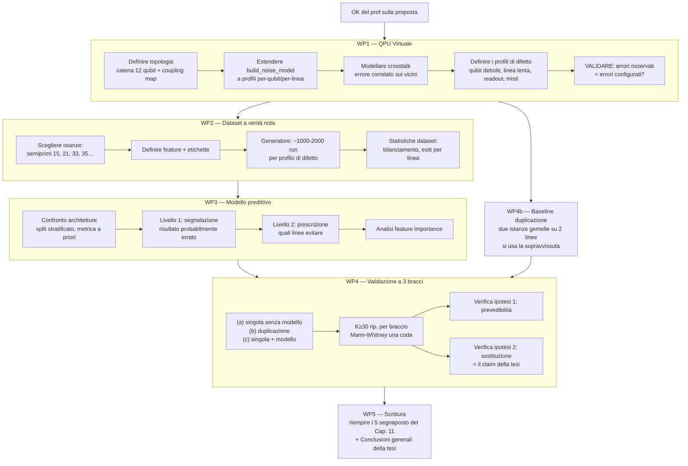

# Mappa della fase sperimentale — Sistema di Gestione Predittiva degli Errori

> I 5 segnaposto *[DA COMPLETARE]* del Capitolo 11 sono la todo-list: ogni work package (WP)
> qui sotto riempie esattamente una sezione già pronta in tesi.
> Prerequisito: ok del prof sulla `proposta_sistema_predittivo.pdf` (5 decisioni in fondo al documento).

## La mappa

## Dettaglio dei work package

### WP1 — QPU Virtuale (`experiments/virtual_qpu.py`)

Riempie: **Cap. 11 → §Implementazione della QPU Virtuale**

| # | Task | Note tecniche |
|---|------|---------------|
| 1.1 | Topologia: catena lineare 12 qubit (8 count + 4 work per N=15), coupling map esplicita | classe `VirtualQPU(topology, qubit_profiles)` |
| 1.2 | T1/T2 **per qubit**: `thermal_relaxation_error` applicato per-qubit (non all-qubit) | Aer: `add_quantum_error(err, gates, qubits=[i])` |
| 1.3 | Gate **per linea**: `depolarizing_error` con ε e durata diversi per coppia accoppiata | per ogni edge della coupling map |
| 1.4 | Readout **per qubit**: `ReadoutError` individuale (matrice di confusione per linea) | `add_readout_error(err, qubits=[i])` |
| 1.5 | **Crosstalk**: quando un gate agisce su qubit i, piccolo errore depolarizzante sui vicini topologici | unica parte non nativa in Aer: da costruire come composizione |
| 1.6 | Profili di difetto nominati e serializzabili (JSON): `uniforme`, `qubit_debole(i)`, `linea_lenta(i,j)`, `readout_degradato(i)`, `crosstalk_forte`, `misto` | riproducibilità: profilo = file |
| 1.7 | **Validazione della QPU virtuale**: run di calibrazione (circuiti noti) → il tasso di errore osservato per linea deve rispecchiare quello configurato | è il criterio di uscita del WP1 |

**Uscita WP1**: modulo testato + tabella parametri + schema topologia → si scrive la sezione in tesi.

### WP2 — Dataset a verità nota (`experiments/generate_dataset.py`)

Riempie: **Cap. 11 → §Generazione del Dataset**

| # | Task | Note |
|---|------|------|
| 2.1 | Istanze: N=15 (a=7) come core; poi 21, 33, 35 (Beauregard se serve profondità gestibile) | prima campagna tutta N=15 (decisione prof) |
| 2.2 | Feature vector: [T1/T2 per qubit usato, ε per linea usata, linee attraversate, profondità, N, a] + esito | definizione PRIMA di generare |
| 2.3 | Etichetta: esito corretto/errato (verità nota: conosciamo p×q) | |
| 2.4 | 1000–2000 run × profilo di difetto × istanza; seed deterministici | riusare orchestrazione `run_experiments.py` |
| 2.5 | Statistiche: bilanciamento classi, tasso errore per linea/profilo | sanity check: la linea "debole" fallisce davvero di più? |

**Uscita WP2**: dataset .npz/.json + tabella statistiche → sezione in tesi.

### WP3 — Modello predittivo (`experiments/train_predictor.py`)

Riempie: **Cap. 11 → §Selezione e Addestramento del Modello**

| # | Task | Note |
|---|------|------|
| 3.1 | Confronto architetture (es. Random Forest, Gradient Boosting, MLP) con split stratificato 80/20, metrica dichiarata a priori | stessa metodologia della fase di verifica |
| 3.2 | Livello 1 — segnalazione: P(esito errato \| condizioni) | output minimo richiesto dal prof |
| 3.3 | Livello 2 — prescrizione: ranking delle linee per affidabilità attesa dato l'input | avanzato, dopo che il livello 1 funziona |
| 3.4 | Feature importance: topologia vs T1/T2 vs linea | diagnostica; interessa il prof (capire CHI genera errori) |

⚠ Le metriche di apprendimento sono SOLO diagnostica — il giudizio è al WP4 (lezione della fase di verifica).

### WP4 — Validazione a 3 bracci (`experiments/run_validation.py`)

Riempie: **Cap. 11 → §Risultati del Confronto**

| # | Task | Note |
|---|------|------|
| 4.0 | **WP4b (fattibile in parallelo dopo WP1)**: implementare la duplicazione — due istanze gemelle su 2 linee distinte della QPU virtuale, lettura di entrambe, uso della sopravvissuta | è la baseline che il sistema vuole sostituire: senza, il claim non è misurabile |
| 4.1 | Braccio (a): copia singola senza modello | già esistente di fatto |
| 4.2 | Braccio (b): duplicazione | da WP4b |
| 4.3 | Braccio (c): copia singola + modello (livello 1; poi livello 2) | |
| 4.4 | K≥30 ripetizioni per braccio × profilo di difetto; Mann-Whitney una coda | riusare `mwu_analysis.py` |
| 4.5 | Ipotesi 1 (prevedibilità): AUC segnalazione vs caso, in funzione della sistematicità dei difetti | |
| 4.6 | Ipotesi 2 (sostituzione) — IL CLAIM: succ(c) ≥ succ(b) con metà qubit, p<0.05 | risultato principale della tesi |

### WP5 — Scrittura

Riempie: **i 5 segnaposto del Cap. 11** + le **Conclusioni generali** della tesi (arco completo:
ipotesi ML a valle → bocciata → sistema predittivo → esito del claim) + eventuale ritocco Sviluppi Futuri.

## Dipendenze e ordine

- **WP1 è il collo di bottiglia**: tutto dipende da lui. Si parte da qui.
- WP4b (duplicazione) dipende solo da WP1 → si può fare **in parallelo** a WP2/WP3.
- WP2 → WP3 → WP4 in sequenza.
- La scrittura (WP5) è incrementale: ogni WP chiuso riempie subito la sua sezione.

## Punti di attenzione (per non ripetere gli errori della prima fase)

1. **Criteri dichiarati prima di implementare** — fatto: sono nel Cap. 11 e nella proposta.
2. **La baseline giusta** — la duplicazione va implementata bene: se è troppo debole il claim è
   gonfiato, se troppo forte è impossibile. Definire con il prof i dettagli (le 2 istanze
   condividono il crosstalk? linee adiacenti o lontane?).
3. **Sanity check del dataset** (task 2.5) prima di addestrare qualsiasi cosa: se la linea
   "debole" non fallisce di più già nelle statistiche grezze, il modello non ha nulla da imparare.
4. **Il modello può fallire** — se l'ipotesi 2 non regge, è comunque un risultato: la tesi ha già
   dimostrato di saper trattare i risultati negativi in modo scientificamente corretto.
